# Beating the Burnout by CodeNectors

**Team:** Chan Yik Jaw, Nicholas Chin Sheng Chong, Brian, Herman
**Problem Statement:** Stress & Workload Manager
**Video Presentation:** [Unlisted YouTube Link — TODO]
**Live demo:** https://beating-the-burnout.ecommerce-app.workers.dev

A stress and workload manager for university students. Every other app tells you "you're at 90% capacity." This one says "move these two things to next week" — and does it in one tap.

---

## 1. Project Overview

### The Problem

University students carry workload across five areas at once — **mental** (studying, focus work), **time** (classes, jobs, fixed hours), **physical** (exercise, health), **social** (friends, family), and **errands** (chores, admin) — and no single tool tracks all five together. That's the root cause: not "students are busy," but that load accumulates *invisibly*, because it's scattered across areas that each look fine in isolation. By the time a dashboard turns red, the burnout has already started.

The stakeholders are the students themselves (primary), and academic staff / campus support services who deal with the downstream effects — missed deadlines, no-shows, burnout-driven withdrawals — once the problem is already visible.

Existing tools fall short in the same way. **Google Calendar / Todoist**-style apps show *what's* scheduled but have no concept of *capacity* — they can't tell a student they've booked more than they can realistically handle, and they never suggest what to do about it. **Mood or wellness trackers** capture how a student feels but have no connection to their actual calendar, so "you seem stressed" never turns into a concrete, schedulable action. Both categories stop at *reporting*; neither one *acts*.

### Our Solution

Beating the Burnout computes a student's real load — booked hours against their own stated weekly capacity, adjusted by how they say they're actually feeling — across all five life areas, and then **does something about it** instead of just displaying it. When the week is overloaded, its Balancer proposes specific commitments to defer and shows the exact before/after; when sleep or heart-rate data signals the student needs to recover, it books a real protected block on the calendar rather than showing a chart.

| Feature | What it does |
|---|---|
| **Capacity dashboard** | One overall load %, uncapped past 100%, plus five per-category rings |
| **The Balancer** | Real rebalancing algorithm — defers the least-important, most-flexible commitments first, one-tap accept or reject |
| **Schedule** | Month calendar + per-day timetable, tap any block to edit |
| **Full commitment CRUD** | Add, edit, mark done/reopen, delete |
| **AI timetable import** | Photograph a class schedule; Google Gemini (vision) extracts every class; review and correct before saving; recurs weekly across a term date range |
| **Wearable sync** | Google Health OAuth reads real sleep and heart-rate data |
| **Recovery nudges** | Poor sleep, elevated heart rate, low activity, overload, or a stress streak each trigger a nudge that books a real protected recovery block |
| **Free-time recommender** | Finds genuinely open slots and suggests an activity from what the student enjoys |
| **Exam revision planning** | Weekly revision-hour target auto-suggested into free slots until met |
| **Check-ins** | Energy, stress, sleep quality in three taps — feeds a felt-load adjustment |
| **Trends** | Real historical stress + load plotted together |
| **Google Calendar export** | Pushes every commitment to the student's real calendar, safe to re-run |
| **Auth** | Email/password, password reset, friendly error copy |
| **Demo data** | One tap seeds a realistic overloaded week so every feature has something to show |

---

## 2. Ideation & Process

### 2.1 Ideas We Considered

| Idea | Why it was kept / dropped |
|---|---|
| **Hybrid capacity + calendar model (Chosen)** | One-time capacity setup, checked against real calendar data and check-ins, so the app has enough signal to *act* — not just report a number. |
| **The Balancer — auto-suggest what to defer (Chosen)** | Directly answers "so what do I do about it," which pure dashboards never do. This became the product's core differentiator. |
| **AI timetable photo import (Chosen)** | Manual timetable entry was the biggest onboarding friction we could see; a photo-to-schedule flow removes almost all of it. |
| **Recovery nudges that book a real calendar block (Chosen)** | Early version only surfaced a suggestion to read; explicitly reworked so accepting a nudge writes an actual protected commitment. |
| Pure analytics dashboard (percentage only, no action) | Dropped — it's the exact pattern of every competing app, and doesn't solve the "invisible until it's too late" problem. |
| Pure calendar, no capacity input | Dropped — with no stated capacity or felt-stress signal, the app can't tell an overloaded week from a normal one. |
| Native mobile app | Dropped — no meaningful benefit for a scoped hackathon build over a fast, installable web app; time was better spent on the balancer logic. |
| Push notifications for nudges | Dropped — explicitly out of scope; in-app cards deliver the same suggestions without OS-level permissions. |
| Streaks / gamification for check-in engagement | Dropped — conflicts with the calm, non-shaming design principle; a missed check-in is not treated as a failure. |
| Fitbit wearable integration | Kept in spirit, technology swapped — Fitbit's developer API was discontinued mid-build; rebuilt on Google Health without changing the feature itself. |
| Anthropic vision API for timetable import | Kept in spirit, technology swapped — hit a real billing wall with no free tier; rebuilt on Google Gemini. |

### 2.2 Ideation Boards

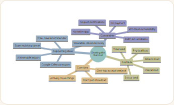
*The initial problem/solution map: five load categories, the core "act, don't just show" idea, the supporting features it justified, and the hard constraints (calm design, no native app, no push, accessibility) the whole build had to respect.*

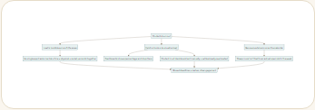
*Root-cause breakdown of "students burn out" into three concrete, addressable failures in existing tools, each traced to its downstream consequence.*

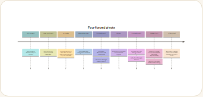
*Four real pivots during the build — two forced by outside vendors (Fitbit's API being discontinued, Anthropic's billing wall), one from direct user pushback on the original percentage-only concept, and one from an explicit "make it act, not just report" requirement.*

### 2.3 Mentor Consultation

| Date | Mentor | Feedback Received | What Was Changed |
|---|---|---|---|
| — | — | — | — |

*Left blank — no mentor was consulted during this build.*

---

## 3. Design & Prototype

**UI Prototype:** https://beating-the-burnout.ecommerce-app.workers.dev

The live link requires signing in (it's a real, working product, not a static mockup). To explore it in an incognito window:

- Sign up with any email — email verification is off for demo purposes — then set weekly capacity, or
- **Demo account:** `[TODO — create a demo@... account and put its password here]`, then go to **Settings → Demo → Load demo data** for an instantly-populated, realistic overloaded week

**Key screens:**

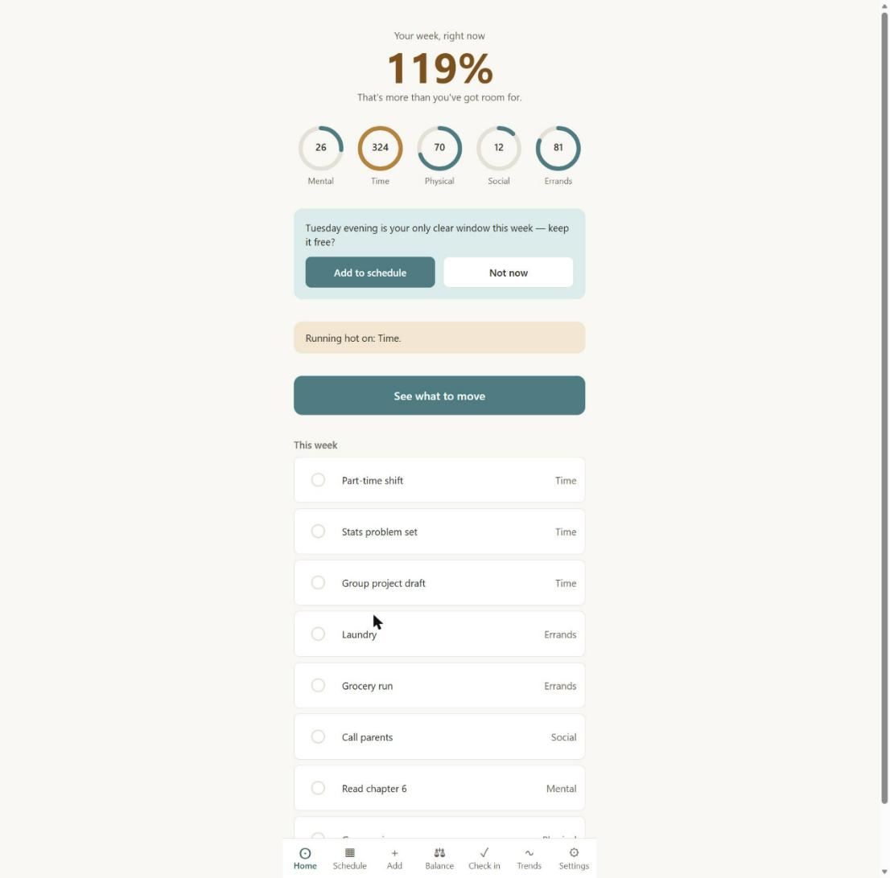
*Home — load percentage, five category rings, and a free-time suggestion card, all driven by real demo data.*

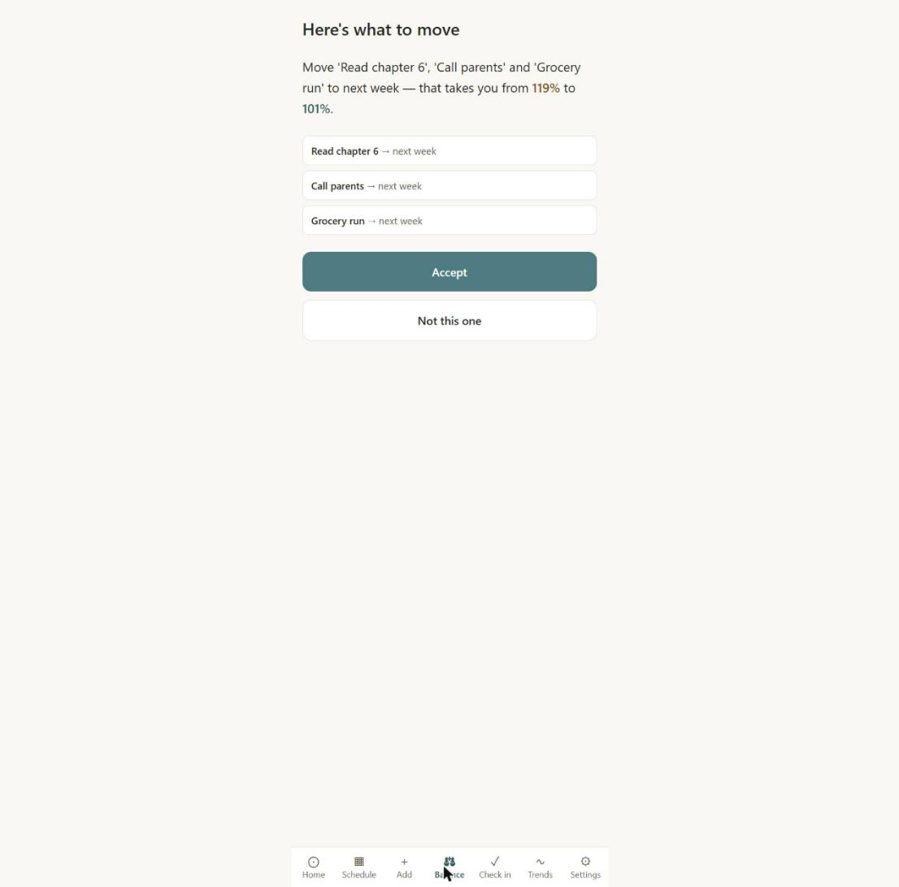
*The Balancer — the exact before/after moment: which commitments to defer and what it does to the percentage.*

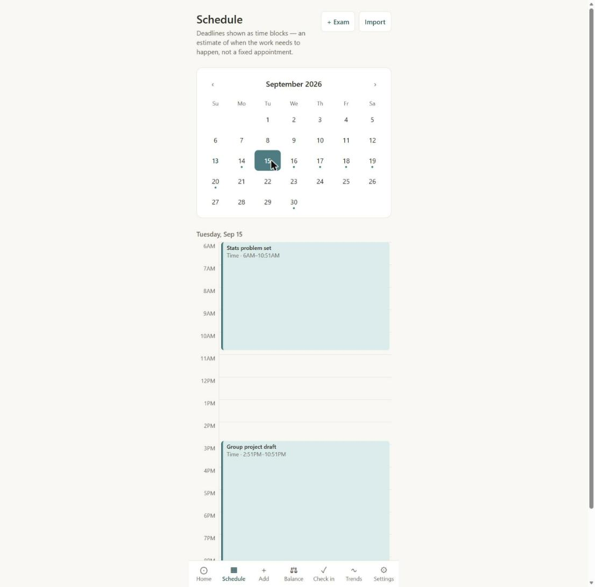
*Schedule — month calendar plus a real hour-by-hour day timetable.*


*A recovery nudge on Home, triggered by a simulated poor-sleep reading — accepting it books a real protected block.*

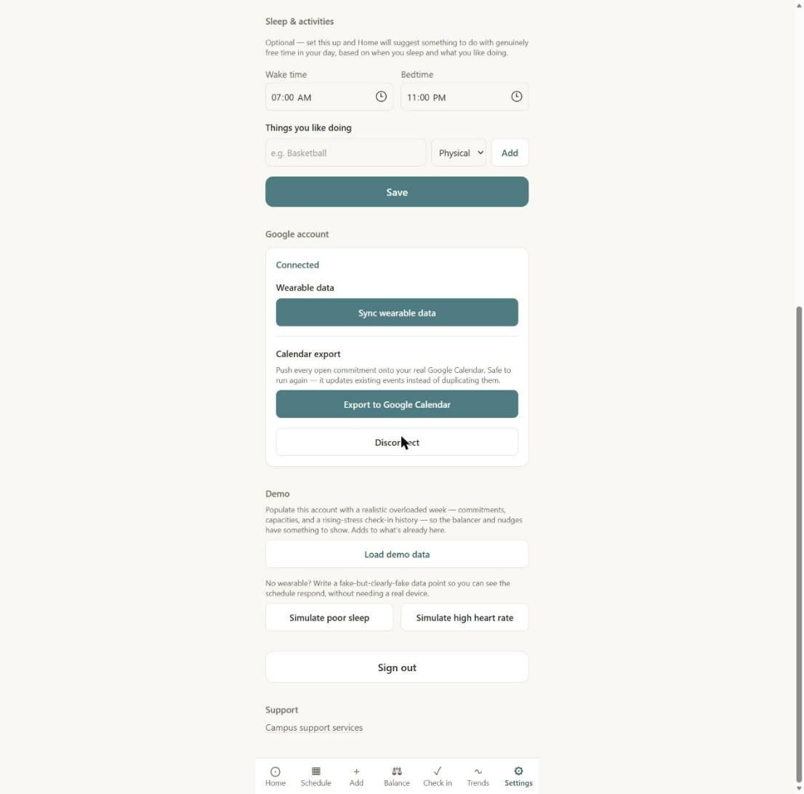
*Settings — Google account connection (wearable sync + calendar export) and the demo-data tools.*

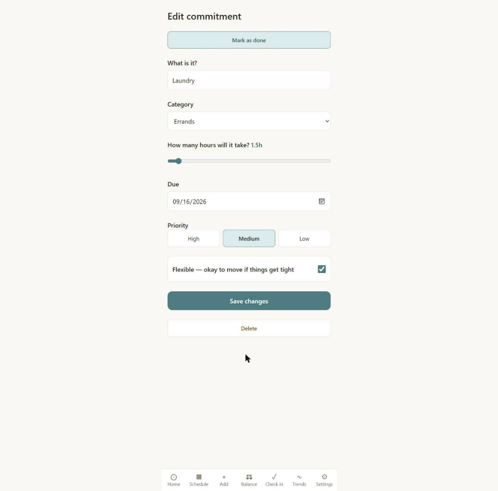
*Full CRUD in one screen — edit, mark done/reopen, or delete.*

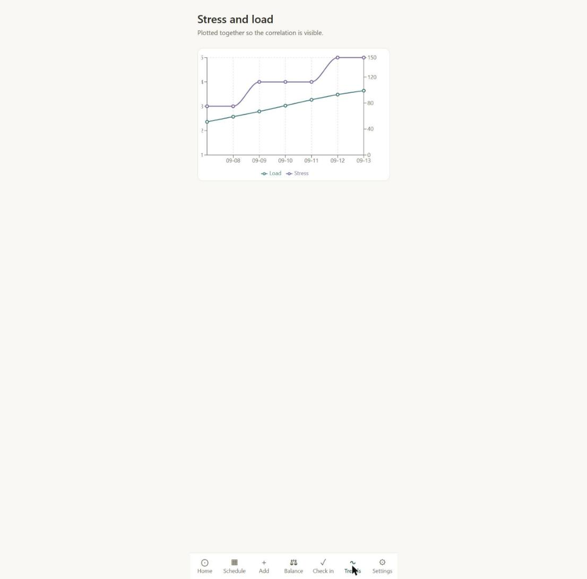
*Trends — real historical stress and load plotted together.*

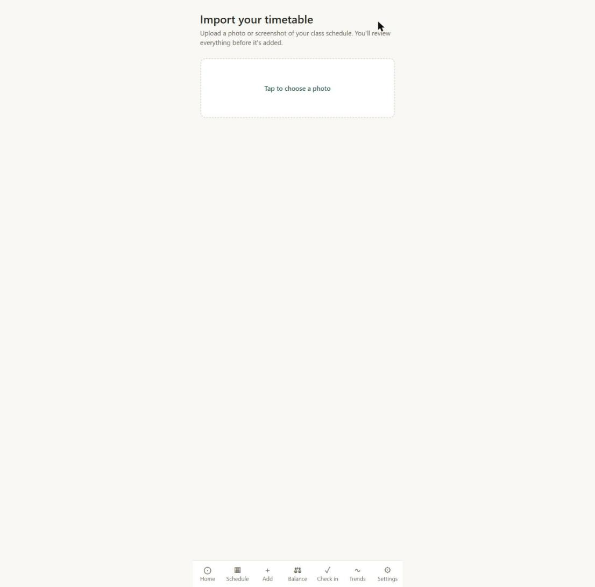
*AI timetable import — photograph a class schedule and Gemini extracts it (review step shown after a photo is uploaded).*

### Design principles

- Calm, low-contrast neutrals with a single accent color — no red alarm states, because the app that manages your stress shouldn't itself be a stressor
- No streaks, no gamification, no shaming copy for missed days
- Never clinical or diagnostic language — workload and energy, not conditions or symptoms
- WCAG AA contrast (verified with the real sRGB-to-linear-luminance formula, not eyeballed), real `<label>`s on every input, 44px minimum tap targets, screen-reader-friendly throughout

---

## 4. What Makes It Different

| | To-do / calendar app | Mood or wellness tracker | Beating the Burnout |
|---|---|---|---|
| Load across 5 life areas | No | Mood only | **Yes** |
| Capacity vs. booked hours | No | No | **Yes** |
| Reads real wearable signals | No | Sometimes | **Yes, tied to the schedule** |
| Suggests what to move | No | No | **Yes — the Balancer** |
| Books real recovery time | No | No | **Yes, automatically** |

The twist isn't any single feature — every signal (calendar, capacity, check-ins, wearable data) feeds one algorithm that's allowed to act: defer a commitment, book a recovery block, or suggest a revision session, always with the student's one-tap accept/reject, never silently.

Recovery isn't just detected either. Poor sleep, an elevated resting heart rate (against your own recent baseline), low activity, an overloaded schedule, or a multi-day stress streak each trigger a specific, actionable nudge that writes a real protected block onto your calendar when accepted. The same philosophy carries through the rest of the app: exam revision time is auto-suggested straight into real free slots, and genuinely free time gets an activity suggestion drawn from what you've said you enjoy.

---

## 5. Technical Architecture & Feasibility

### Tech stack

| Layer | Choice | Why | Constraint accepted |
|---|---|---|---|
| Frontend | React 19 + Vite + TypeScript + Tailwind CSS v4 | Fast iteration, strong typing for a data-heavy app | — |
| Hosting | Cloudflare Workers | One-command deploy, zero server to provision during the event | — |
| Backend | Supabase (Postgres, Auth, Row-Level Security, Edge Functions) | Managed DB + auth + RLS with no DevOps — entire backend live on day one | Vendor lock-in to Supabase's Postgres flavor |
| Charts | Recharts | Simple dual-axis line charts for Trends | — |
| AI | Google Gemini (vision) | Free tier, after Anthropic's API proved paid-only with no free tier | Model availability churned (503/404) during development — mitigated by pinning a confirmed-working model |
| Wearables + Calendar | Google Health API + Google Calendar API (OAuth 2.0) | Replaced a deprecated Fitbit Web API | OAuth consent screen currently unverified — shows a warning to non-test users until Google verification is completed |

### System architecture

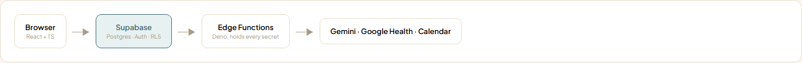

- **Row-level security everywhere.** All 12 tables have RLS enabled from the first migration: owner-only access via `(select auth.uid()) = user_id`, enforced at the database, not just in application code. Verified with Supabase's own security advisor after every schema change.
- **Pure-function core.** The scoring engine, rebalance algorithm, recovery-nudge logic, schedule-grid math, free-time slot finder, and exam-revision suggester (`src/lib/*.ts`) are all framework-free, fully unit-tested, and never mutate their inputs.
- **Secrets never reach the client.** Three Supabase Edge Functions (Deno) hold every third-party secret: `extract-schedule` (Gemini API key), `fitbit-oauth-callback` / `fitbit-sync` (Google OAuth client secret + token exchange), and `calendar-sync`. The browser bundle never sees an API key or client secret.
- **A stated, deliberate approximation.** `commitments` stores a deadline (`due_at`) and a duration (`effort_hours`), not a literal start time. Every "when does this actually happen" calculation treats the block as *ending* at the deadline and running backward for the duration.

### Build plan & scope

Built core-out, in six phases, each shipping on a foundation that already worked:

1. **Foundation** — DB schema, RLS policies, pure scoring engine + unit tests, before any UI existed
2. **Shell + auth** — six-screen app on fixtures, then real Supabase wiring, email auth, protected routes
3. **Calendar core** — schedule view, AI timetable import, exam revision planning
4. **Signals** — wearable sync, recovery nudges that write real blocks, free-time recommender
5. **Completeness** — full commitment CRUD, Google Calendar export, historical Trends
6. **Polish** — accessibility contrast audit + fix, demo data, visual design pass, documentation

The scope deliberately excluded a native app, push notifications, and payments from the start, which kept the build inside a single web codebase a small team could ship and test within the event's time window.

**Engineering quality, verifiable directly:**
- 74 automated tests, 100% passing (`npm test`), covering the entire scoring/balancer/recovery/free-time/exam-revision engine
- Zero TypeScript errors (`npm run build`)
- Two real bugs found and root-caused during the build: an onboarding race condition (data loaded before auth resolved) and a missing Row-Level Security policy that silently broke an OAuth connection — both traced by querying the database directly, not guessed at

---

## Local development

```bash
npm install
npm run dev      # start the dev server
npm test         # run the full test suite (74 tests)
npm run build    # type-check + production build
npm run deploy   # build + deploy to Cloudflare Workers
```

You'll need a `.env.local` with:

```
VITE_SUPABASE_URL=<your Supabase project URL>
VITE_SUPABASE_PUBLISHABLE_KEY=<your Supabase publishable key>
VITE_GOOGLE_HEALTH_CLIENT_ID=<your Google OAuth client ID, if using wearable sync / calendar export>
```

Database schema and RLS policies live as Supabase migrations. Edge Function secrets (`GEMINI_API_KEY`, `GOOGLE_HEALTH_CLIENT_ID`, `GOOGLE_HEALTH_CLIENT_SECRET`) are configured directly in the Supabase dashboard, never committed to the repo.
